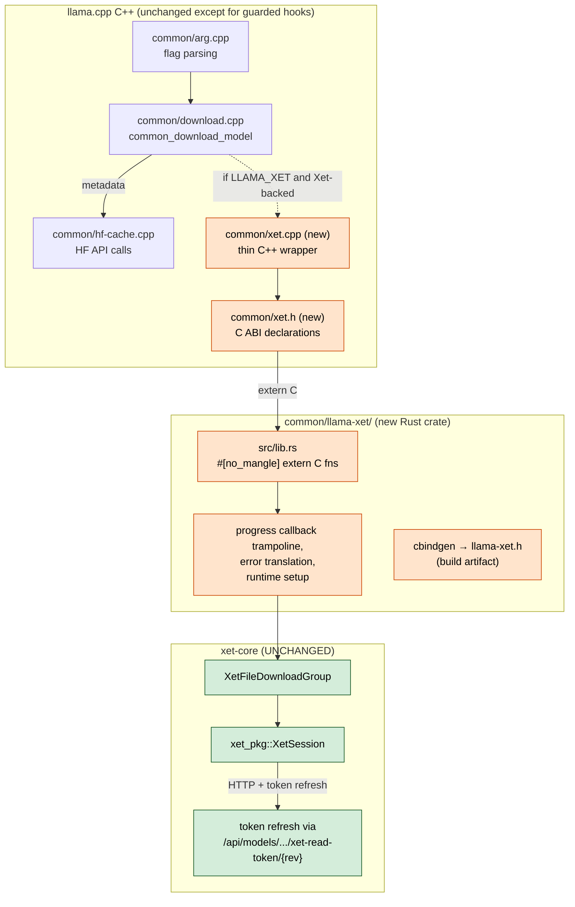
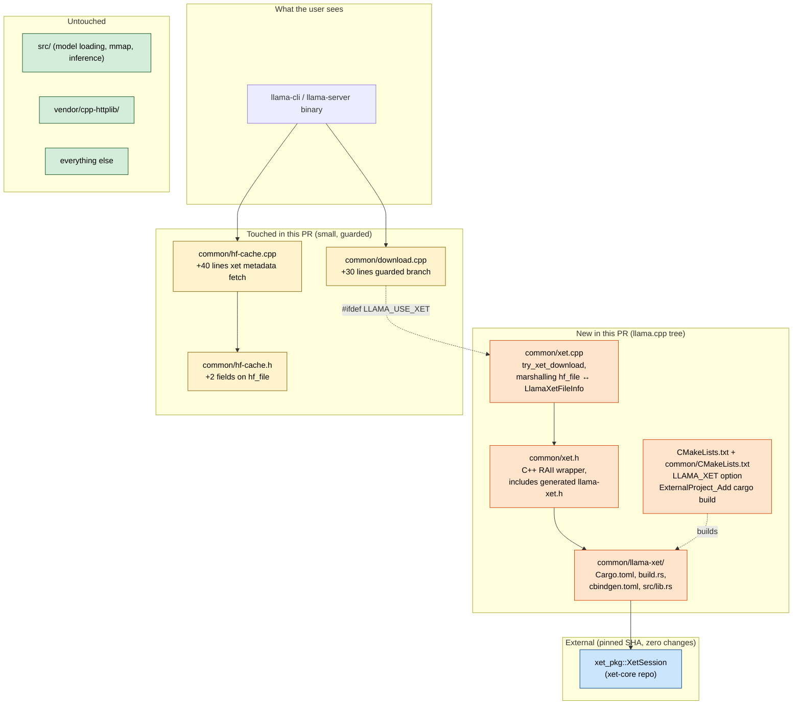
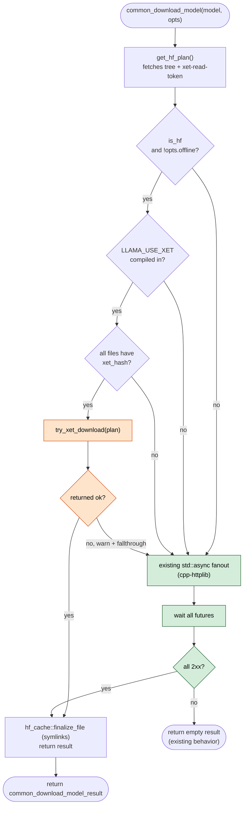
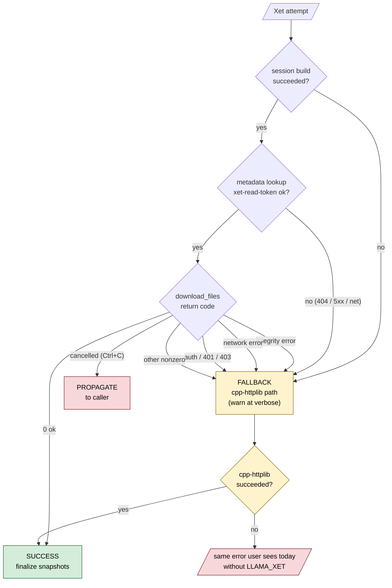

# llama.cpp × hf-xet Integration — Design Spec

| Field | Value |
|---|---|
| Status | DRAFT — awaiting human review |
| Author | Rajat Arya (`@rajatarya`) |
| Date | 2026-04-23 |
| Target | Upstream `ggml-org/llama.cpp` |
| Related | `work/reading/repo/llama-cpp-xet-integration.md` (Obsidian investigation note) |
| llama.cpp SHA | `12568ca8c8176785f5da005a5be17064c72c5536` |
| xet-core SHA | `b43c0aec0e1b7725e3b46aab373b56f29b8ed1f5` |

---

## 1. Context

llama.cpp downloads GGUF models from Hugging Face over plain HTTPS using a vendored `cpp-httplib` client. The download logic lives in `common/download.cpp` and `common/hf-cache.cpp`, orchestrated by `common_download_model()`. For multi-file models (multipart GGUFs, `mmproj` aux files), llama.cpp fans out per-file downloads via `std::async`. There is zero Xet awareness in the codebase.

Hugging Face now backs many model repositories with Xet — a content-addressed, chunk-based storage layer that dedupes content across files and across users. The `hf-xet` Rust crate (part of the `xet-core` workspace) provides a `XetSession` API for downloading Xet-backed files; `huggingface_hub` already uses it from Python. Adopting `XetSession` in llama.cpp gives users:

1. **Faster downloads of multi-file models** — chunks shared across files in the same multipart GGUF are fetched once.
2. **Faster re-downloads** — chunks already present in `~/.cache/huggingface/hub/blobs/` are skipped.
3. **Faster downloads of variants** — downloading a different quantization of the same base model reuses common chunks.
4. **Better resilience** — chunk-level retry, resume mid-file on connection failure.

## 2. Goals

1. When `LLAMA_XET=ON` at build time, `llama-cli -hf org/repo` uses `XetSession` to download Xet-backed files; falls back transparently to the existing cpp-httplib path for non-Xet files.
2. Binary size and behavior of the default build (`LLAMA_XET=OFF`) are unchanged.
3. xet-core requires zero changes. All FFI glue lives in a new crate inside the llama.cpp tree.
4. Cache layout remains `~/.cache/huggingface/hub/{blobs,snapshots,refs}/...` — compatible with `huggingface_hub`.
5. PR is small enough to land. Net change: one new `common/xet.h` + `common/xet.cpp`, one new Rust crate (`common/llama-xet/`), ~30 lines of guarded branching in `common/download.cpp`, ~40 lines of Xet-metadata parsing in `common/hf-cache.cpp`, CMake wiring cloned from the existing llguidance pattern.
6. Integration ships with a benchmark report (cold cache, warm cache, resilience) in the PR description, demonstrating measurable wins over the cpp-httplib path.

## 3. Non-goals

- **Upload.** llama.cpp has no upload surface today (no `llama-push`, no HF POST code). Xet upload is a possible follow-up PR, out of scope here.
- **Replacing cpp-httplib.** Xet handles *byte transfer* for Xet-backed files only. llama.cpp still uses cpp-httplib to call HF's JSON metadata APIs (`/api/models/.../tree/...`, `/api/models/.../xet-read-token/...`) regardless of `LLAMA_XET`.
- **Removing `LLAMA_OPENSSL`.** HTTPS to `huggingface.co` is still required. `LLAMA_XET=ON` implies `LLAMA_OPENSSL=ON`.
- **Session caching / global singletons.** `XetSession` is created and dropped per `common_download_model()` call. No process-wide state.
- **New CLI flags.** Behavior is automatic: if the repo is Xet-backed and `LLAMA_XET=ON`, Xet is used. No `--use-xet` flag.

## 4. Architecture



## 5. Components

### Component ownership at a glance



### 5.1 CMake wiring (cloned from llguidance pattern)

Top-level `CMakeLists.txt` adds one option near existing HTTP/Rust options (line ~117):

```cmake
option(LLAMA_XET "llama-common: use hf-xet for HF model downloads" OFF)
```

In `common/CMakeLists.txt`, mirroring the llguidance block (lines 140–166):

```cmake
if (LLAMA_XET)
    if (NOT LLAMA_OPENSSL)
        message(FATAL_ERROR
            "LLAMA_XET=ON requires LLAMA_OPENSSL=ON "
            "(HF metadata API is still fetched over HTTPS).")
    endif()

    include(ExternalProject)
    set(LLAMA_XET_SRC  ${CMAKE_SOURCE_DIR}/common/llama-xet)
    set(LLAMA_XET_PATH ${CMAKE_BINARY_DIR}/llama-xet/target/release)
    set(LLAMA_XET_LIB_NAME "${CMAKE_STATIC_LIBRARY_PREFIX}llama_xet${CMAKE_STATIC_LIBRARY_SUFFIX}")

    ExternalProject_Add(llama_xet_ext
        SOURCE_DIR         ${LLAMA_XET_SRC}
        PREFIX             ${CMAKE_BINARY_DIR}/llama-xet
        CONFIGURE_COMMAND  ""
        BUILD_COMMAND      cargo build --release --target-dir ${CMAKE_BINARY_DIR}/llama-xet/target
        BUILD_IN_SOURCE    1
        INSTALL_COMMAND    ""
        BUILD_BYPRODUCTS   ${LLAMA_XET_PATH}/${LLAMA_XET_LIB_NAME}
                           ${LLAMA_XET_PATH}/llama-xet.h
    )

    target_compile_definitions(${TARGET} PUBLIC LLAMA_USE_XET)
    add_library(llama_xet STATIC IMPORTED)
    set_target_properties(llama_xet PROPERTIES IMPORTED_LOCATION ${LLAMA_XET_PATH}/${LLAMA_XET_LIB_NAME})
    add_dependencies(llama_xet llama_xet_ext)
    target_include_directories(${TARGET} PRIVATE ${LLAMA_XET_PATH})
    target_link_libraries(${TARGET} PRIVATE llama_xet)
endif()
```

Same structure maintainers have already approved for llguidance. Reviewing this block means "did they clone the pattern correctly", not "do we accept a new pattern".

### 5.2 Rust wrapper crate: `common/llama-xet/`

A thin, llama.cpp-local Rust crate whose only job is to expose a stable C ABI over `xet_pkg::XetSession`. Vendors xet-core as a git dependency pinned to a known SHA.

**Integration point: `XetSession` — not the legacy `data_client::download_files` path.** The Python `hf_xet::download_files` entry point (in `hf_xet/src/lib.rs:274`) wraps `data_client` for backwards compatibility with `huggingface_hub`'s older consumers. That is *not* the model to copy. The Rust shim in this crate is built directly on:

- `XetSessionBuilder::new().with_tokio_handle(...).build()` — or runtime-owned mode when called outside tokio
- `XetSession::new_file_download_group()` — the canonical, forward-looking download primitive
- `XetFileDownloadGroup::download_file_to_path()` queued per file
- `.finish_blocking()` to wait for the whole batch

`XetSession` is the same surface used by emerging consumers like OpenDAL and Parquet readers for Xet-backed blob access — building on it means llama.cpp joins a small but growing set of projects that can share bug fixes, perf improvements, and API stabilization work upstream. Building on the legacy `data_client` would isolate llama.cpp on a code path other consumers are moving off of.

The C function name `llama_xet_download_files` is chosen for familiarity — it reads naturally to a C++ caller — but its body uses `XetSession` primitives exclusively.

```
common/llama-xet/
├── Cargo.toml          # deps: xet_pkg (git+rev), libc, once_cell
├── cbindgen.toml       # generates llama-xet.h at build time
├── build.rs            # invokes cbindgen into OUT_DIR/llama-xet.h
└── src/
    └── lib.rs          # all extern "C" fns (~200 lines)
```

`Cargo.toml` pins xet-core:

```toml
[package]
name    = "llama-xet"
version = "0.1.0"
edition = "2021"

[lib]
name       = "llama_xet"
crate-type = ["staticlib"]

[dependencies]
xet_pkg   = { git = "https://github.com/huggingface/xet-core", rev = "b43c0aec" }
libc      = "0.2"
once_cell = "1"
```

### 5.3 C ABI — `common/xet.h` (hand-written) + `llama-xet.h` (generated)

Design principles cribbed from `common/llguidance.cpp`:
- Opaque handles only (`LlamaXetSession*`). Rust types never cross the boundary.
- POD structs for inputs. C-strings (`const char *`) for identifiers and error messages.
- RAII-style create/destroy. No silent global state.
- Error reporting: last-error pattern via thread-local accessor; or rich error codes + `llama_xet_last_error_message()` on the session.

The generated `llama-xet.h` (via cbindgen) will contain declarations equivalent to:

```c
typedef struct LlamaXetSession LlamaXetSession;

typedef struct {
    const char * hash;          // Xet Merkle hash
    uint64_t     file_size;     // known size or 0 if unknown
    const char * dest_path;     // absolute path; parent dirs must exist
} LlamaXetFileInfo;

typedef void (*LlamaXetProgressFn)(
    void *   user_data,
    uint64_t completed_bytes,
    uint64_t total_bytes);

// Creates a new session and its internal tokio runtime.
// endpoint:           CAS URL base (or NULL to resolve from token_refresh_url)
// bearer_token:       HF token string (or NULL for anonymous)
// token_refresh_url:  HF xet-read-token URL, e.g.
//                     "https://huggingface.co/api/models/org/repo/xet-read-token/main"
// Returns NULL on failure; call llama_xet_last_error() for details.
LlamaXetSession * llama_xet_session_new(
    const char * endpoint,
    const char * bearer_token,
    const char * token_refresh_url);

void llama_xet_session_free(LlamaXetSession * session);

// Downloads N files in one group. Blocks until complete.
// Progress callback fires with cumulative totals across the whole group.
// Returns 0 on success, nonzero error code on failure.
// On partial failure, files that completed remain on disk.
int32_t llama_xet_download_files(
    LlamaXetSession *        session,
    const LlamaXetFileInfo * files,
    size_t                   file_count,
    LlamaXetProgressFn       progress_cb,
    void *                   progress_user_data);

// Thread-local last error message; valid until next xet call on this thread.
const char * llama_xet_last_error(void);

// Requests cancellation of an in-flight llama_xet_download_files call.
// Safe to call from a signal handler. The pending download_files call
// will return a nonzero "cancelled" error code shortly after.
void llama_xet_session_abort(LlamaXetSession * session);
```

The hand-written `common/xet.h` is a thin shim that includes `llama-xet.h` under `#ifdef LLAMA_USE_XET` and defines C++-friendly wrappers (RAII unique_ptr deleter, `std::string` error getter).

### 5.4 C++ integration — `common/download.cpp`

One guarded branch added to `common_download_model()` between the `get_hf_plan()` call and the `std::async` fanout:

```cpp
#ifdef LLAMA_USE_XET
    if (is_hf && !opts.offline && all_files_xet_backed(hf.model_files)) {
        auto result = try_xet_download(hf, opts);     // in common/xet.cpp
        if (result.ok) {
            // finalize + return — reuses existing hf_cache::finalize_file path
            for (const auto & f : hf.model_files) hf_cache::finalize_file(f);
            common_download_model_result r;
            r.model_path  = hf.primary.final_path;
            r.mmproj_path = !hf.mmproj.path.empty()
                ? hf_cache::finalize_file(hf.mmproj)
                : "";
            return r;
        }
        // fall through to std::async fanout on xet failure
        LOG_WRN("xet download failed (%s); falling back to HTTPS\n", result.error.c_str());
    }
#endif
    // existing std::async fanout, UNCHANGED
```

`try_xet_download` lives in `common/xet.cpp` — builds the session, marshals `hf_file` → `LlamaXetFileInfo`, calls `llama_xet_download_files`, translates errors. RAII ensures the session is freed whether the download succeeds, fails, or throws.

**The fallback is mandatory.** If anything goes wrong with Xet — session creation, token refresh, network error, chunk integrity failure — we fall through to the cpp-httplib path. Xet must never prevent a download that would have succeeded without it.

#### Decision flow inside `common_download_model`



Orange = new / Xet-fast-path. Green = existing cpp-httplib path, unchanged. Every decision point either proceeds on the Xet path or falls through to the existing behavior.

### 5.5 HF metadata — `common/hf-cache.cpp`

`get_repo_files()` currently parses the HF tree API response into `hf_file { path, url, local_path, final_path, oid, size }`. Two extensions:

1. **Parse `xet_hash` per file** from the tree response (HF returns this when a file is Xet-backed). Added as `std::string hf_file::xet_hash` (empty string ⇒ not Xet-backed).
2. **Fetch the Xet token** once per call to `get_hf_plan()`: GET `/api/models/{repo}/xet-read-token/{rev}` with bearer token, parse `{accessToken, exp, casUrl}`. Stored in the `hf_plan` struct for passing to the session.

The token-refresh URL is constructed as `{MODEL_ENDPOINT}/api/models/{repo}/xet-read-token/{rev}` and passed to `llama_xet_session_new` — xet-core refreshes as needed during long downloads.

`all_files_xet_backed(files)` → true iff every file in the plan has a non-empty `xet_hash`. If any file is not Xet-backed, we take the fallback path for the whole batch. (Mixed Xet + non-Xet in one plan is rare and adds complexity for little gain.)

## 6. Data flow

```mermaid
sequenceDiagram
    autonumber
    participant U  as user (llama-cli -hf org/repo)
    participant A  as common/arg.cpp
    participant D  as common_download_model
    participant H  as hf-cache.cpp
    participant HFAPI as huggingface.co<br/>(cpp-httplib)
    participant X  as common/xet.cpp
    participant R  as llama-xet (Rust)
    participant CAS as xet CAS

    U->>A: flags + env
    A->>D: common_download_model(model, opts)
    D->>H: get_hf_plan()
    H->>HFAPI: GET /api/models/org/repo/refs
    HFAPI-->>H: {commit}
    H->>HFAPI: GET /api/models/org/repo/tree/{commit}?recursive=true
    HFAPI-->>H: [files with xet_hash fields]
    H->>HFAPI: GET /api/models/org/repo/xet-read-token/{commit}
    HFAPI-->>H: {accessToken, exp, casUrl}
    H-->>D: hf_plan (files + xet_token)

    alt LLAMA_USE_XET and all files Xet-backed
        D->>X: try_xet_download(hf_plan, opts)
        X->>R: llama_xet_session_new(endpoint, token, refresh_url)
        R-->>X: LlamaXetSession*
        X->>R: llama_xet_download_files(session, infos, n, progress_cb)
        R->>CAS: chunks over HTTPS (parallel, dedup-aware)
        CAS-->>R: bytes → dest_paths
        R-->>X: 0 (ok)
        X->>R: llama_xet_session_free(session)
        X-->>D: ok
    else fallback
        D->>D: existing std::async fanout<br/>via cpp-httplib
    end

    D->>H: finalize_file (symlink snapshots → blobs)
    D-->>A: model_path
    A->>U: llama_model_load_from_file(path)
```

## 7. Error handling

| Failure | Behavior |
|---|---|
| `LLAMA_XET=OFF` build | Compiler elides all Xet code. Zero runtime impact. |
| HF API returns no `xet_hash` fields | `all_files_xet_backed()` false. Existing cpp-httplib path used. Silent. |
| `xet-read-token` endpoint 404 or 5xx | Xet path skipped. Warn at verbose log level. Fall back to cpp-httplib. |
| `llama_xet_session_new` fails | Warn. Fall back. |
| `llama_xet_download_files` returns nonzero | Warn with error message. Fall back to cpp-httplib. Partial files on disk are tolerated — cpp-httplib's resume will pick them up. |
| Chunk integrity check fails | Xet-internal retry. If unrecoverable, caller sees error → fallback. |
| Token expiry mid-download | xet-core refreshes via `token_refresh_url` — no action needed by llama.cpp. |
| User Ctrl+C | llama.cpp signal handler calls `llama_xet_session_abort()` (to be exposed); Rust drops in-flight futures cleanly. |

**Principle**: the cpp-httplib path is the ground truth. Xet is a performance shortcut that is always skippable. No user-facing error should be "Xet failed" — it should be either a successful fallback-path download, or the same error they'd get today without Xet.

#### Fallback decision tree



The yellow "FALLBACK" node is reachable from every failure state except user cancellation. User cancellation propagates (Ctrl+C should feel instant).

## 8. Tests

- **Unit tests (Rust side)**: in `common/llama-xet/` — session lifecycle, error translation, progress callback invocation, null-pointer guards. Run via `cargo test` when `LLAMA_XET=ON`.
- **C++ unit tests**: a new `tests/test-xet-fallback.cpp` exercising the C ABI with a mock session (linked stub) — verifies llama.cpp's fallback logic triggers on every documented failure mode.
- **Integration test (offline by default)**: small GGUF hosted on a public Xet-backed HF repo, downloaded in a tiny CI job behind `LLAMA_XET_E2E=1`. Not run by default — opt-in. Measures end-to-end wall clock on the GitHub runner.
- **No changes to default CI**. Build matrix gains a `LLAMA_XET=ON` row on Linux x86_64 to confirm the build doesn't regress.

## 9. Benchmark plan (PR description material)

Published alongside the PR to justify the complexity:

| Scenario | Metric | Baseline | Target |
|---|---|---|---|
| Cold cache, 30 GB multipart Xet-backed GGUF | wall clock, bytes downloaded | cpp-httplib | hf-xet batch |
| Warm cache, re-download same model | wall clock, bytes downloaded | cpp-httplib | hf-xet (should near-zero both) |
| Warm cache, different quantization of same base model | wall clock, bytes downloaded | cpp-httplib | hf-xet (dedup wins visible) |
| Connection dropped at 50% | recovery success rate, total time | cpp-httplib | hf-xet |
| Non-Xet repo (older LFS-only model) | wall clock | cpp-httplib | cpp-httplib (confirms fallback is zero-cost) |
| `LLAMA_XET=OFF` build | final binary size | baseline | identical to baseline |

Machine: clean VM, one network interface, no pre-populated cache between runs. Numbers reported with standard deviation over 5 runs.

## 10. PR strategy

1. **File an issue first** at `ggml-org/llama.cpp`: "Proposal: optional hf-xet download backend for HF models". Reference the llguidance precedent. Link the benchmark plan. Ask for maintainer appetite before writing PR-track code.
2. On a green light, open a draft PR with the Rust crate, CMake wiring, and a **no-op `common/xet.cpp`** — establishes the build wiring. Easier to review in two passes.
3. Follow-up commit in the same PR adds the actual `try_xet_download` logic and the `common_download_model` branch.
4. Final commit adds tests and the benchmark table in the PR description.
5. **AI-assistance disclosure** in the PR body per `AGENTS.md` — a short paragraph: "Investigation and design exploration done with AI assistance; implementation, benchmarks, and all code written by the contributor, who takes full responsibility for maintenance."
6. Commit message format per `CONTRIBUTING.md`: `common : add optional hf-xet download backend (#NNNN)`.

## 11. Risks & open questions

| Risk | Mitigation |
|---|---|
| HF tree API schema for `xet_hash` may differ from assumed. | Verify against live API before implementation. If absent, derive from `xet-read-token` response or from a HEAD `X-Xet-*` header. Keep the metadata-fetch function isolated so the schema detail is localized. **If metadata retrieval fails for any reason (schema drift, network, auth), log at verbose level and fall through to the cpp-httplib path — never block the download on Xet metadata.** |
| xet-core pinned SHA drifts over time. | Pin to a known-good SHA in `Cargo.toml`; upgrade in separate dependency-bump PRs. Don't track `main`. |
| Rust toolchain becomes a hard build dep for anyone enabling `LLAMA_XET`. | Already true for `LLAMA_LLGUIDANCE`. `LLAMA_XET=OFF` default means no new requirement for the common build. Document in `docs/build.md`. |
| Binary size increases when `LLAMA_XET=ON`. | Report the size in the PR. Expected +2–5 MB from tokio/reqwest/hashing. `OFF` default protects people who don't want it. |
| Benchmarks don't show meaningful wins. | If measured wins are marginal, withdraw the PR — the complexity isn't justified. The benchmark is not a formality. |
| Maintainers reject the feature outright. | Respect the decision. Keep the work on a private fork. The issue-first step exists precisely to discover this before writing code. |

## 12. Follow-ups (explicitly out of this PR)

- Xet upload support (requires `llama-push` or similar, which doesn't exist).
- Wiring Xet into the `llama-server` model-download-on-demand path.
- Session sharing across multiple `common_download_model` calls within one process.
- Per-file Xet/non-Xet mixing inside one plan.

---

_AI-assisted design document. Implementation will be human-authored per `AGENTS.md`._
